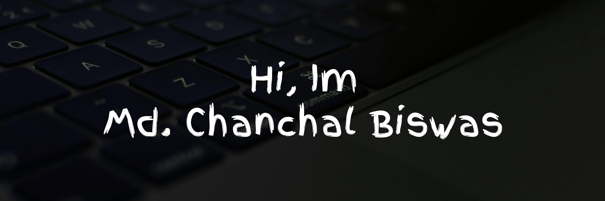

Hey there👋  
I'm Md. Chanchal Biswas, a full-stack web developer with over 8 years of professional experience. My expertise
lies in **PHP** development, **MySQL** database management, and proficiency in frameworks like **Laravel** and **CodeIgniter**.

🚀 Throughout my career, I've been dedicated to delivering high-quality web solutions, leveraging my skills in backend
development, database design, and server-side scripting. I'm passionate about creating efficient and scalable web 
applications that meet the needs of users and businesses.

🌐 Let's connect and explore the world of web development together! Feel free to check out my repositories and projects.
If you have any questions or collaboration opportunities, don't hesitate to reach out.

Want to know more about me? [Check out my portfolio.](https://chanchal.net)

## 🛠️ My Technical Skill Set Includes:

__Programming Language__
1. PHP
2. Javascript
3. SQL and PL SQL
4. C++
5. Java

__Database__   
1. MySQL
2. PostgreSQL
3. Oracal

__Web Development__
1. HTML/CSS
    - HTML5
    - CSS3 
    - Sass/SCSS
2. Frameworks
    - Laravel
    - CodeIgniter
3. Frontend Libraries
    - ReactJS
    - jQuery

More Skills

__Version Control__
1. Git
2. GitHub

__DevOps__
1. Docker

__Web Servers__
1. Apache

__Operating Systems__
1. macOS
2. Windows

__Other Tools__
1. PHPStorm 
2. Visual Studio Code 
3. Sublime Text 
4. Postman
5. Android Studio
6. Visual Studio

## 📌 Pinned Repositories

  

> ### My Blog and Videos
>
> Check out my [tutorial](https://www.youtube.com/@net.chanchal)!
